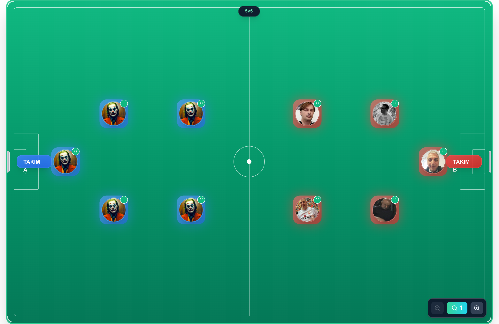

# Palmiye Futbol



Mini futbol sahası yönetimi, kadro yerleşimi ve maç istatistikleri uygulaması.

## Özellikler

-   Saha görünümü ve kadro yönetimi.
-   Formasyon seçimi ve takım listeleri.
-   Maç ekleme, düzenleme, silme.
-   Gol ekleme, düzenleme, silme ve admin onayı.
-   İstatistikler ve lider tabloları.
-   Golleri TXT olarak dışa aktarma (tüm maçlar veya tek maç).

## Gereksinimler

-   Node.js 20+
-   npm 9+

## Kurulum

```
npm install
```

## Hızlı Başlangıç

```
git clone https://github.com/Chapulcu/MNF.gitcd MNFnpm installnpm run dev
```

## Çalıştırma

```
npm run dev
```

Prod build:

```
npm run buildnpm start
```

## Docker ile Deploy

```
docker compose up --build -d
```

## Yedekleme ve Geri Yükleme

Backup:

```
sh scripts/db-backup.sh
```

Geri yükleme:

```
sh scripts/db-restore.sh /path/to/football-db-YYYYMMDD-HHMMSS.tar.gz
```

Not: Geri yükleme öncesi container çalışıyorsa durdurmanız önerilir.

## Kullanım Notları

-   Gol süresi `ss`, `mm:ss` veya `hh:mm:ss` formatında girilebilir.
-   Admin kullanıcılar maç/gol düzenleyebilir ve golleri onaylayabilir.
-   Admin olmayan kullanıcılar gol ekleyebilir, onay admin tarafından yapılır.

## Sayfalar

-   `/` Ana saha ekranı.
-   `/admin` Admin paneli (oyuncu yönetimi).
-   `/stats` Maçlar ve istatistikler.
-   `/share` Paylaşım görünümü.

## API

Tüm istekler `app/api` altında Next.js route handler’ları ile çalışır:

-   `/api/players`
-   `/api/matches`
-   `/api/goals`
-   `/api/stats`
-   `/api/settings`

## Veri

SQLite veritabanı kullanılır (`lib/db/sqlite.ts`).

## Sık Karşılaşılan Sorunlar

-   **Failed to create match**: DB şeması veya insert placeholder uyumsuzluğu. `lib/db/sqlite.ts` kontrol edilir.
-   **Paylaşım çalışmıyor**: Tarayıcı Web Share desteklemiyorsa PNG indirir.

## Lisans

Özel kullanım.